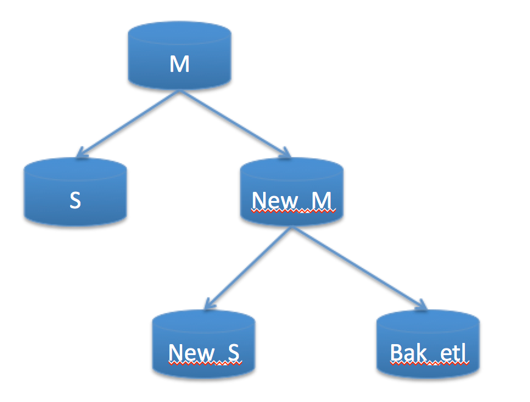
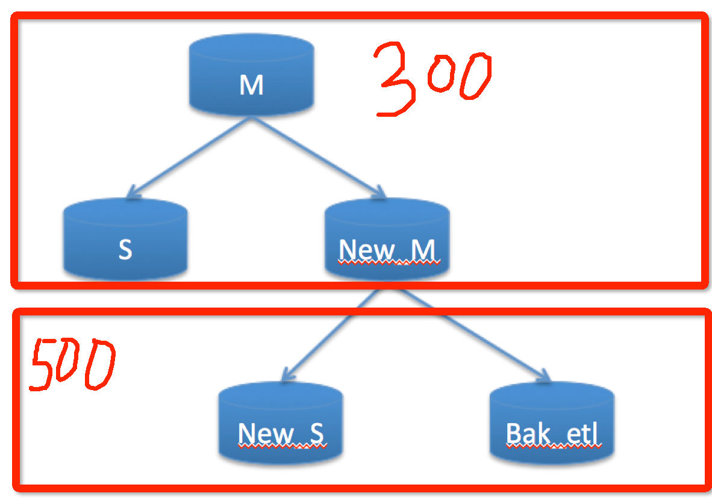
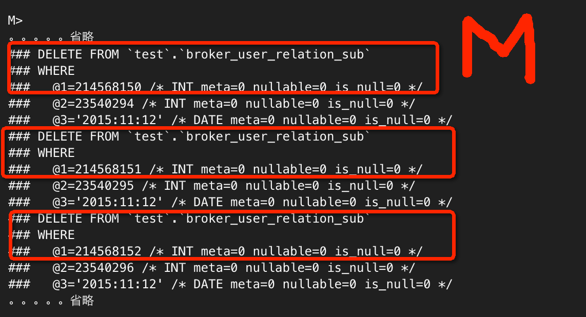
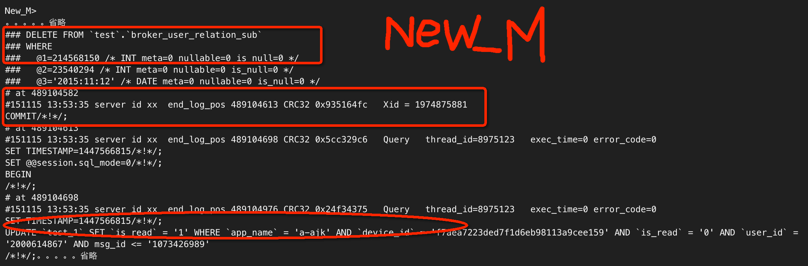
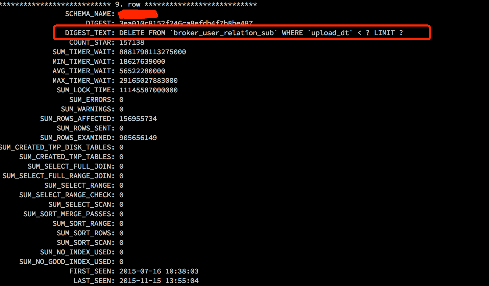
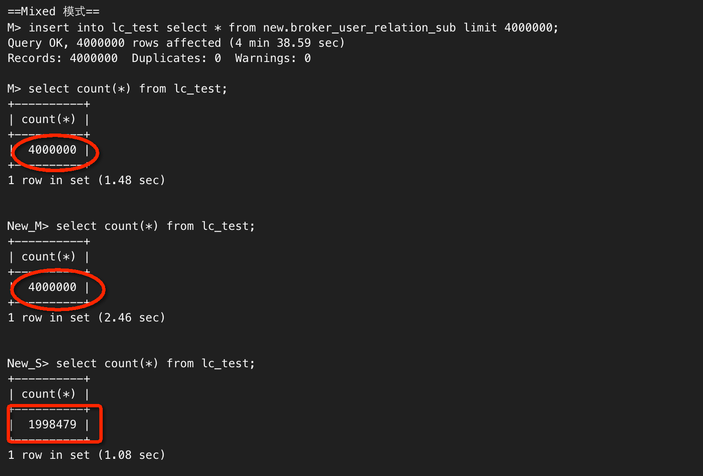
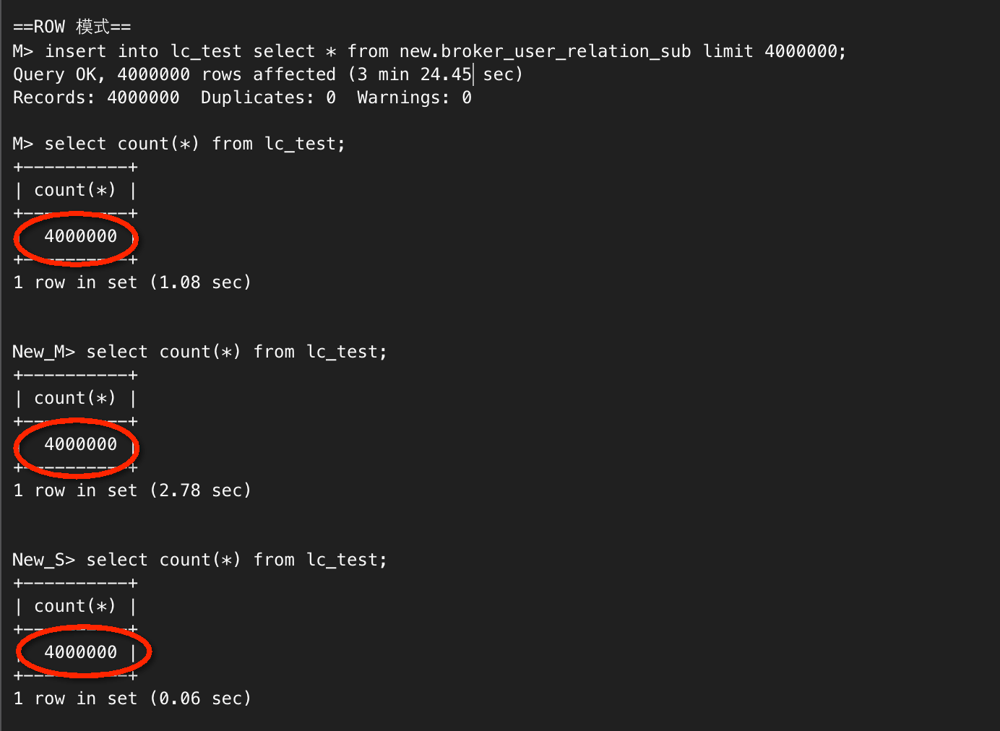

# Mixed format + DML limit 引发的血案

---

## 背景

> 0. MySQL版本 5.6.16
> 1. DB架构（级联复制） M --> New_M（log_slave_update）--> S  
> 2. 相信做DB拆分，机房搬迁，数据库升级，都会用到这种类似的架构吧。 
> 3. 那么问题来了，最近做数据校验的时候，发现New_S 的数据竟然比 M,New_M 还多，是否奇怪？   

## 案例&分析

> 1. 如何做数据校验？  pt-table-checksum ，或自己写对比程序。  
> 2. 校验出来后，发现A表在M，S，New_M三个实例上 有300条记录， New_S,Bak_etl 却有500条记录  

为什么New_M的数据比New_S的数据还要少呢？？？  
这种情况下，只能比对binlog了，但是binlog数据量如此之大，如何查呢？  
具体分析下，M,S,New_M的数据是一样的，说明他们之间的复制同步没有问题。  
New_S和Bak_etl 数据是一样的，说明他们之间执行的binlog也没问题。  
那么问题就出在M的binlog ， New_M的binlog不一致了。  
换句话说就是：一条delete语句，在M上删除了N条，但是在New_M的binlog中只记录了delete N-200  
从而导致最后的slave比master要多200条记录了。  
接下来，我们验证下  

### M的binlog

 
### New_M的binlog

很明显，New_M 相比 M，少了很多binlog event，有部分binlog（从214568151开始，全部丢失）都没了。

ok，问题确认了，但是由于SQL语句已经被强制转换成了ROW模式的关系，SQL语句如何定位呢？  
还好，这里有5.6新特性Performance schema的帮助，很快定位到了问题SQL

performance_schema> select * from events_statements_summary_by_digest where DIGEST_TEXT like '%broker_user_relation_sub%'\G

到这个地步，有几个问题：

> 1） 为什么binlog会丢失？  
> 2） 什么情况下会丢失？  

这几个问题，经过反复测试，得出以下结论。

* **为什么binlog会丢失？**

> 条件1：当binlog format 设置为mixed时，普通复制不会有问题，但是级联复制在特殊情况下会binlog丢失。  
> 条件2：当出现大量数据（400W左右）扫描的更新，删除，插入的时候，且有不确定dml语句（如：delete from table where data<'N' limit ）的时候.  
> 当条件1 和 条件2 同时满足时，会导致问题的发生。以上案例，就是证据。  

接下来，我们再来测试下我们的理论。这次我们不用delete + limit，用 insert into select  

### Mixed 模式

### ROW 模式

## 总结

强烈建议MySQL binlog format 设置成ROW模式来确保主从数据的一致性。

>  set global binlog_format=ROW;  
>  禁止非确定性因素的DML，尤其是delete limit 等等。

 
