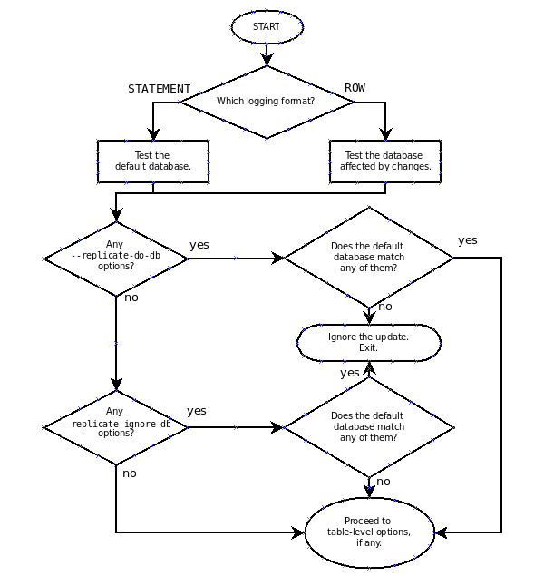
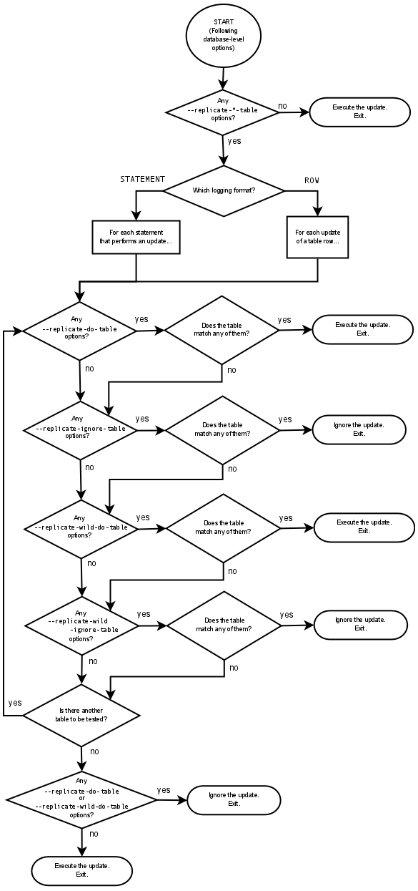

# Mysql 复制过滤详解

---

## 一、背景

如果有这样的一个需求：master 有3个库A，B，C ，D，由于某种原因，现在需要将其中2个库B，C单独拆分出来，单独一个实例。 如果是你，打算怎么做呢？  常见的做法就是，单独搭建一个只有B，C库的实例，然后只复制master的B，C库，过滤掉A，D库。那么复制过滤就应运而生了，replicate-*-do-DB/table 等。

## 二、理由

为了搭建这一套环境（只复制master的B，C库），部分人会在my.cnf中这样配置：

```
 --replicate-do-db=B,C
``` 
当然，按照大家的惯性思维，认为这样是没有错的。不幸的是，灾难已经来临。

官方文档：

```
Warning
To specify multiple databases you must use multiple instances of this option. Because database names can contain commas, if you supply a comma separated list then the list will be treated as the name of a single database.
```
mysql 会认为`B,C` 为一个库名，而不是2个库。

然而，这里不仅仅有一个复制过滤参数，一共包括：

```
--replicate-do-db 
--replicate-ignore-db
--replicate-do-table
--replicate-wild-do-table
--replicate-ignore-table
--replicate-wild-ignore-table

```

这里面可以随意组合，且不同组合有不同的含义，为了彻底搞清楚他们直接的关系，下面我们一起来一窥究竟。


## 三、Database-Level Replication 流程图

> 注意1：库级别的规则，只针对binlog_format='STATEMENT or MIXED‘     
> 注意2：如果是binlog_format=‘ROW’，不受库级别规则限制，只受表级别规则限制。  


---




## 四、Table-Level Replication 流程图
---


## 五、相关要点

> 注意： 以下测试和结论，前提都是row_format='MIXED'   

---

* **在DB level 中，当binlog-format=statement 时，过滤以use DB为主（不允许跨库）。为rows模式是：不以use DB为主（允许跨库）**

* **不管binlog格式是statement，还是rows模式，table level的判断都是 不以use DB为主（可以跨库的）**

* **总的流程走向：先判断DB-level，如果DB-level 判断完成后需要exit，则退出。如果DB-level判断完成后，没有exit，则再判断Table-level**

* **在DB-level中，如果有replicate-do-db，则判断replicate-do-db，将不会走到replicate-ignore-db这层。 如果判断replicate-do-db符合条件，则判断table-level。 如果不符合，则exit**

* **在DB-level中，如果没有replicate-do-db，但是有replicate-ignore-db。 流程则是：符合replicate-ignore-db规则，则exit，不符合，则走到table-level层继续判断**

* **在Table-level中，判断逻辑顺序自上而下为：replicate-do-table ->  replicate-ignore-table -> replicate-wild-do-table -> replicate-wild-ignore-table **

* **在Table-level中, 从第一个阶段（replicate-do-table）开始，如果符合replicate-do-table判断规则，则exit。如果不符合，则跳到下一层（replicate-ignore-table）。 然后以此内推，直到最后一层（replicate-wild-ignore-table）都不符合，则最后判断是否有（replicate-do-table or replicate-wild-do-table），如果有，则ignore & exit。如果没有，则execute & exit**

## 六、测试
> 注意： 以下测试和结论，前提都是row_format='MIXED'   

---


### 6.1 特殊情况

说明：以下测试，均以statement格式为例。 rows模式参见原理同样可以证明，这里就不解释。

* **第一种情况：设置replicate_do_DB=A,B**
 
```
 
结论：A和B都没有在slave上执行。因为mysql将'A,B'作为一个库名。
```

### 6.2 只有库级别的规则


#### 注意： 


* **do-db**

```
replicate_do_DB=A
replicate_do_DB=B
```


* **ignoare-db**

```
replicate_ignore_DB=A
replicate_ignore_DB=B

```


* **do-db & ignore-db**

```

replicate_do_DB=A
replicate_do_DB=B
replicate-ignore-db=mysql
replicate-ignore-db=test

```

### 6.3 只有表级别的规则


* **do-table**

* **ignore-table**

* **wild-do-table**

* **wild-ignore-table**

* **do-table & ignore-table**

* **do-table & wild-ignore-table**

* **wild-do-table & wild-ignore-table**


### 6.4 库和表级别的规则混用


* **do-DB & do-table**

```
replicate_do_DB=A
replicate_do_DB=B
replicate-do-table=table1
replicate-do-table=table2
```


* **do-DB & wild-do-table**


```
replicate_do_DB=A
replicate_do_DB=B
replicate-wild-do-table=mysql.%
replicate-wild-do-table=test.%
```

* **do-DB & ignore-table**

```
replicate_do_DB=A
replicate_do_DB=B
replicate-ignore-table=table1
replicate-ignore-table=table2

```

* **do-DB & wild-ignore-table**

```
replicate_do_DB=A
replicate_do_DB=B
replicate-wild-ignore-table=mysql.%
replicate-wild-ignore-table=test.%
```


* **最常见场景： db-db & do-ignore-db & wild-do-table & wild-ignore-table**

```
* 常见场景：将master上的A，B库 拆分到 新的一组机器上。
* 特点：
	1） slave 不复制 master的 mysql，test库
	2） slave 只复制 master的 A，B库所有操作

replicate-ignore-db=mysql
replicate-ignore-db=test
replicate-wild-ignore-table=mysql.%
replicate-wild-ignore-table=test.%

replicate_do_DB=A
replicate_do_DB=B
replicate-wild-do-table=A.%
replicate-wild-do-table=B.%


* 误区：
	1) 如果我的default database 不是A或者B，那么接下来的操作就不会被slave 执行，然后悲剧就产生了。
	master> use C；insert into A.id values(1);  
	
	2）所以，以上cnf配置，只适合default database 是 A，B的情况。


* 如果要完成这种需求，应该这样配置【前提：开发没有权限登陆到mysql，test库】：


replicate-ignore-db=mysql
replicate-ignore-db=test
replicate-wild-ignore-table=mysql.%
replicate-wild-ignore-table=test.%

replicate-wild-do-table=A.%
replicate-wild-do-table=B.%


```


* **实战： wild-do-table & ignore-table & wild-ignore-table **


```
需求: 将老服务器上的某个库，迁移到新机器上

old_master[库： A , B , mysql] ---->(同步) new_maser[A]   

        * 验证单库(A)复制的正确性: 规则=> slave 只复制A库，不复制B库 
			my.cnf
				Replicate_Wild_Do_Table: A.% 
				Replicate_Ignore_DB: mysql
		   	    Replicate_Wild_Ignore_Table: mysql.%

		a）use A/B; insert A.a select B.b from B ;  --err：同步报错，slave没有B库的内容
		b) use A/B; insert A.a select B.b from A,B where A.b=B.b;   --err：同步报错，slave没有B库的内容
		c) use mysql; insert into A.a values('a'); --err: 同步不报错，但是老master的binlog没有在slave执行，因为Replicate_Ignore_DB: mysql,Replicate_Wild_Ignore_Table: mysql.%
		
		d) use 空库; insert into A.a values('a');  --ok: 可以同步复制下来
		e) use B;   insert into A.a values('a');  --ok: 可以同步复制下来

```


由于组合太多，就不一一列举。


## 最后
---

以上情况，还可以衍生出各种场景和组合，只要弄懂了原理，基本都没有问题。
