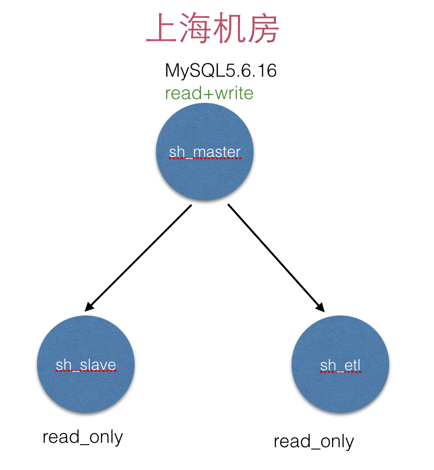
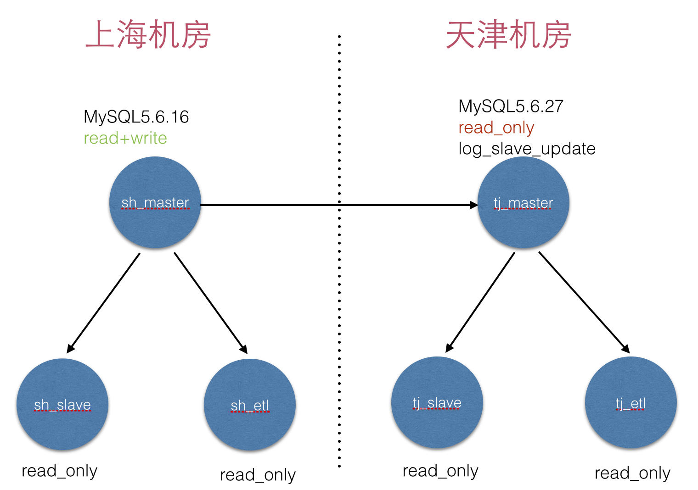
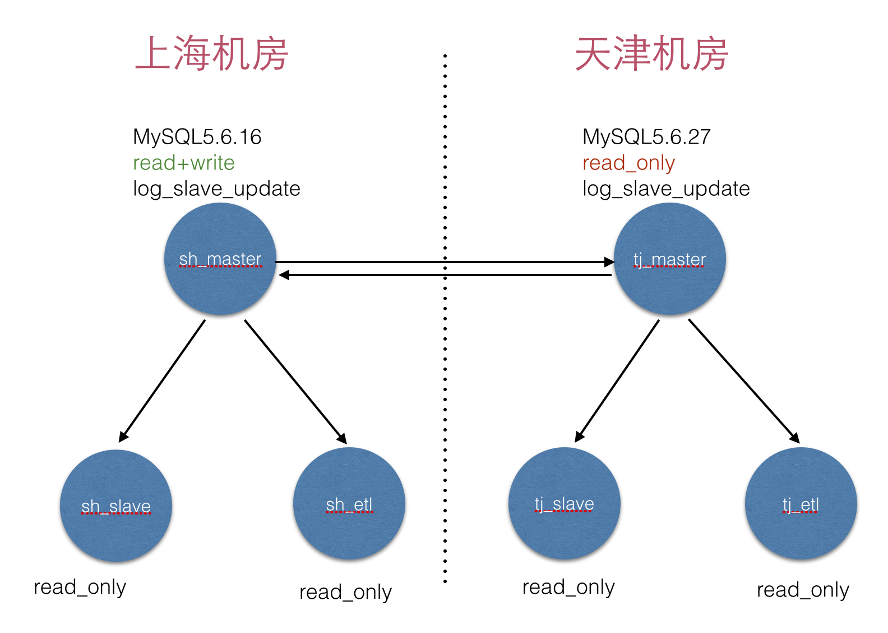
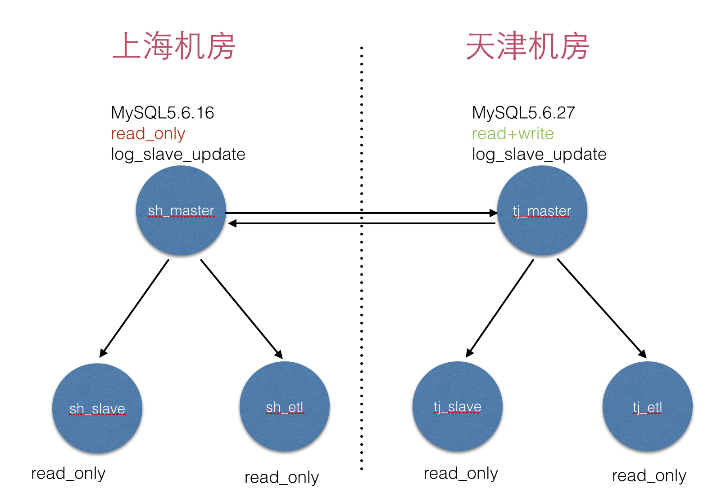
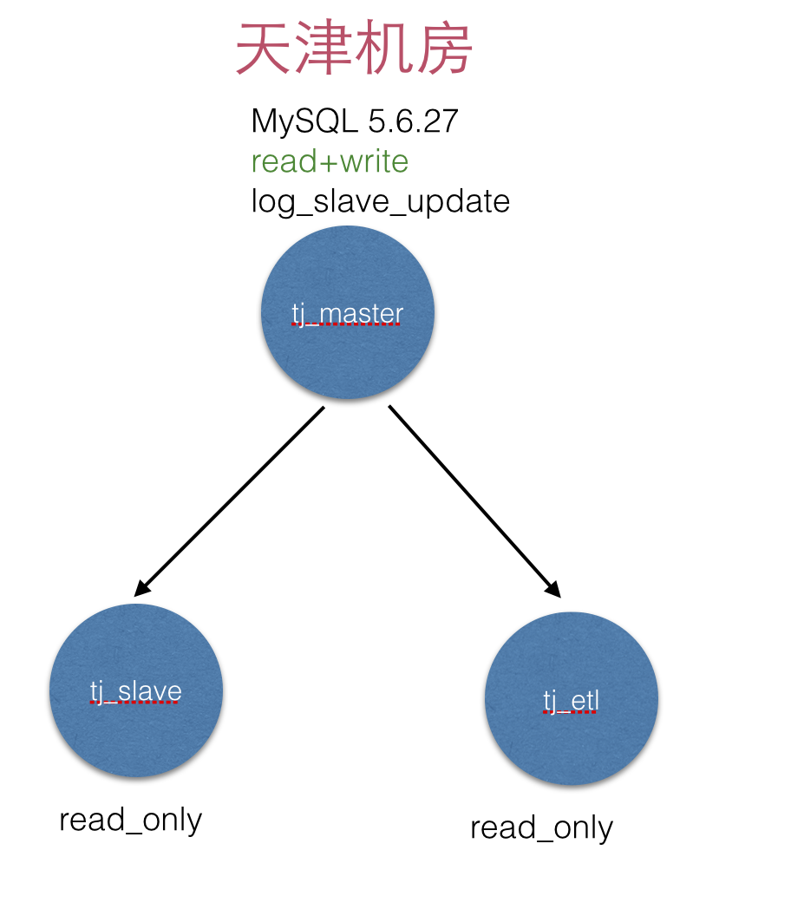

# 机房搬迁（数据库迁移）
---
> 背景：将上海机房所有数据库全部搬迁到天津机房  

## 一、架构图

### 原来上海机房DB架构



### 切换前的DB架构--上



### 切换前的DB架构--下



### 切换后的DB架构



### 最终天津机房DB架构



## 二、outage之前

* **设置上海master，天津master 为binlog-format ROW模式**

* **2.1 搭建DB架构，做好级联复制 并且 天津数据库升级到5.6.27**

* **2.2 做好天津的binlog，全备，监控**

* **2.3 做好上海和天津的数据校验**

* **2.4 修改 上海&天津 master的my.cnf**

```
1. read_only
2. log_slave_update
3. 修改复制过滤规则，只保留mysql，test库的规则。
```
* **2.5 修改所有slave，etl的 my.cnf**

```
1. read_only
2. 修改复制过滤规则，只保留mysql，test库的规则。
```

* **2.6 检查天津master&slave的账号**

```
1. 设置成和上海master一致。
```

* **2.7 升级所有etl机器的内核**

* **2.8 初始化所有etl机器的os，mysql专用账号，并通知dw，appetl切换**

* **2.9 准备好天津的正式DCT配置并check**

* **2.10 停止上海master的所有维护脚本**


* **2.11 停掉上海的master**

```
sh_master> mysqladmin -uroot -p shutdown
tj_master> show master status\G --记录下来 ${PA}

```

* **2.12 开启上海的master，并同步到天津的master**

```
sh_master> stop slave;reset slave;
sh_maser> change master to tj_master position=${PA};
sh_master> start slave;
```


## 三、正式outage

* **3.1 等待ops挂维护页，JoB停写**

* **3.2 设置上海master为read_only模式**

```
1. sh_master> set global read_only=on;
```

* **3.3 删除上海maser的长连接**

```
1. sh_master> perl kill_conn.pl
```

* **3.4 确认上海master停止写入**

```
1) sh_master> show master status;
2) tj_master> show slave status\G

如果sh_master状态值都没有变化，说明已经停止干净
如果tj_master状态值都没有变化，说明已经追上同步

可以进行下一步操作。。。


```

* **3.5 打开tj_master的读写模式**

```
tj_master> set global read_only=off;
```

* **3.6 将读写全部切换到天津的master**

```
开发开启天津的程序，读取天津的DCT
```


* **回退方案**

```
* 3.1 回退方案
	 停止维护页，开启job
* 3.2 回退方案
	sh_master> set global read_only=off;
	
* 3.3 回退方案
	不需要回退
	
* 3.4 回退方案 
    不需要回退
    
* 3.5 回退方案
	tj_master> set global read_only=on;

* 3.6 回退方案
	开发停掉天津的写，不是用天津的dct
	开发开启上海的写，使用上海的dct
```


## 四、outage之后

* **4.1 迁移job**

* **4.2 观察监控**

