# mysql replication inside

>
Mysql 之所以能够风靡全球，除了其innoDB 存储引擎外，另一个最为有力的武器就是 Replication。
M-M，M-S，M-M-S，M-S-S 等等高扩展性，将其推倒了互联网的风口浪尖。有的人会问：这些特性难道
Oracle 没有吗？没错，oracle 也可以这样做，但是这样做的成本非常巨大，每台oracle，都配备EMC
存储，IBM的服务器，这样的高额成本，不是一般公司能够支付。so，这里，我们一起来聊聊Mysql 复制的那些事。


## 主要的大纲

* **classic replication**
  * 复制架构
  	* 复制的历史
  	* 复制结构流程图
  	* show slave status 详解
  	* IO thread, SQL thread状态变更
  * 复制细节
  	* I/O thread数据格式
  	* SQL thread数据格式
  
* **replication internal**
  * binlog 详解（classic & GTID）
  	* statment
  	* row
  	* mixed
  	* binlog 文件格式，data event 详细描述
  	  * Tuning and Optimizing Row-based Replication (5.6)
  	  * group commit
  	  * 二阶段提交
  	  * binlog 的三段提交
  * innodb日志刷新策略
  	* 刷新频率
  	* 刷新方式
	* VFS
  * 多线程复制（5.6，5.7，mariaDB）
  	* 5.6 的实现简介
  	* 5.7 的实现简介
  	* MariaDB 的实现简介
  * slave-crash-safe（5.6）
  * Event Checksums （5.6）
  

* **new replication GTID**
  * 5.6 的 binlog 文件格式详细描述
  * GTID 复制原理
  * 如何 fail over
  * GTID 目前的limitation

## classic replication
---

### 复制的历史

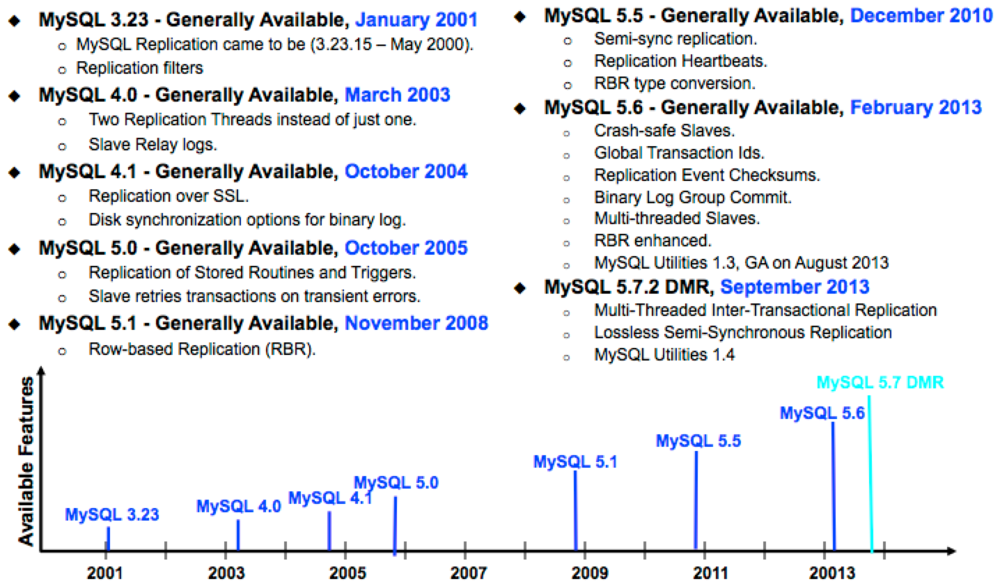

### 复制结构流程图

先看一个简单一点的流程图

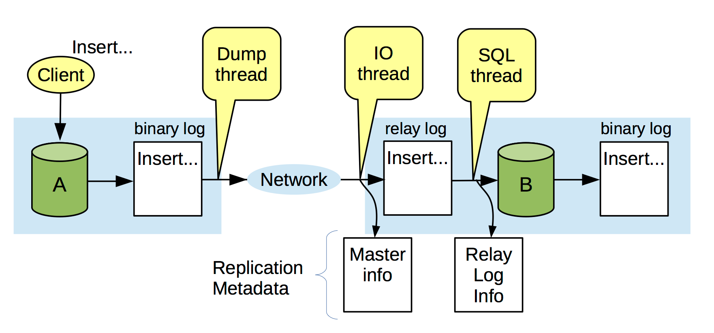

接下来就是整个复制的详细流程图

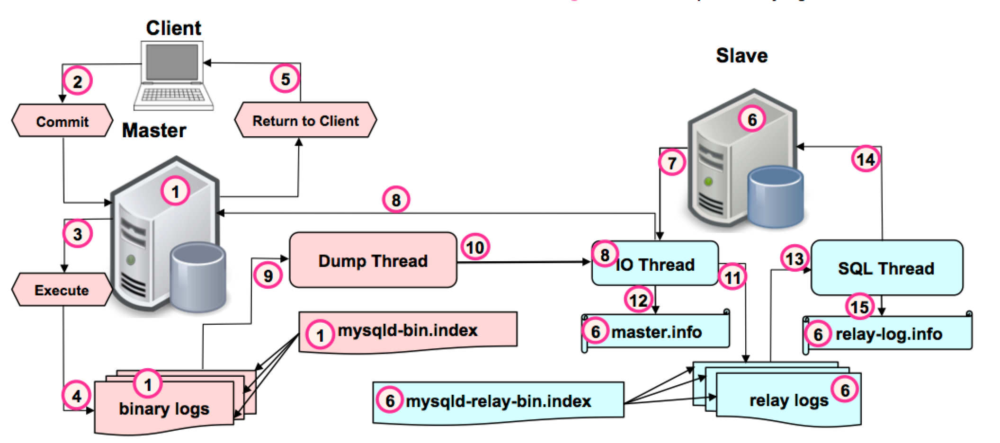

1. Master server enables binary log

2. Client commits query to the master
3. Master executes the query and commits it
4. Master stores the query in the binary log as en event
5. Master returns to the client with commit confirmation
6. Slave server configures replication
7. Replication starts mysql> START SLAVE;
8. IO thread starts and initiates dump thread on the master
9. Dump thread reads events from binary log
10. Dump thread sends events to IO thread from the slave
11. IO thread writes events into relay log
12. IO thread updates master.info file parameters
13. SQL thread reads relay log events
14. SQL thread executes events on the slave
15. SQL thread updates relay-log.info file

### show slave status 

如果使用复制，那么show slave status 这条命令就是我们的家常便饭了，我们对它了解的有多少呢？

```
Server version: 5.1.54-log Source distribution

dbadmin:(none)> show slave status \G
*************************** 1. row ***************************
               Slave_IO_State: Waiting for master to send event
                  Master_Host: 10.10.8.83
                  Master_User: repl
                  Master_Port: 3306
                Connect_Retry: 60
              Master_Log_File: db10-075.006664
          Read_Master_Log_Pos: 116188628
               Relay_Log_File: db10-012-relay-bin.013676
                Relay_Log_Pos: 116188772
        Relay_Master_Log_File: db10-075.006664
             Slave_IO_Running: Yes
            Slave_SQL_Running: Yes
              Replicate_Do_DB:
          Replicate_Ignore_DB: mysql,test
           Replicate_Do_Table:
       Replicate_Ignore_Table:
      Replicate_Wild_Do_Table:
  Replicate_Wild_Ignore_Table: mysql.%,test.%
                   Last_Errno: 0
                   Last_Error:
                 Skip_Counter: 0
          Exec_Master_Log_Pos: 116188628
              Relay_Log_Space: 116188972
              Until_Condition: None
               Until_Log_File:
                Until_Log_Pos: 0
           Master_SSL_Allowed: No
           Master_SSL_CA_File:
           Master_SSL_CA_Path:
              Master_SSL_Cert:
            Master_SSL_Cipher:
               Master_SSL_Key:
        Seconds_Behind_Master: 0
Master_SSL_Verify_Server_Cert: No
                Last_IO_Errno: 0
                Last_IO_Error:
               Last_SQL_Errno: 0
               Last_SQL_Error:
1 row in set (0.00 sec)

```

下面详细解释一下

字段名 | 注释 | 可能取值 | 取值示例 |
----|----|----|----|
Slave_IO_State | slave状态的文字描述 | slave线程状态（下面会讲） | Waiting for master to send event 
Master_Host| master的ip & host |  | 10.10.8.83
Master_User| 连接master使用的用户名 | | repl
Master_Port| master使用的端口 | | 3306
Connect_Retry | 重新连接MySQL的重试间隔时间，单位秒	 | | 60
Master_Log_File| IO thread读取到的binlog日志文件 | | db10-075.006664
Read_Master_Log_Pos| IO thread读取到的binlog日志文件位置 | | 116188628
Relay_Log_File | IO thread读取后，slave 在本地缓存的relay 日志的文件名 | | db10-012-relay-bin.013676
Relay_Log_Pos | IO thread读取后，slave 在本地缓存的relay 日志的文件位置 | | 116188772
Relay_Master_Log_File | SQL thread 执行到master的binlog文件名 | | db10-075.006664
Slave_IO_Running | IO thread是否正常运行 | | Yes
Slave_SQL_Running | SQL thread是否正常运行 | | Yes
Replicate_Do_DB | slave上需要执行的schema | | 
Replicate_Ignore_DB | slave上需要忽略的schema | | mysql,test
Replicate_Do_Table | slave上需要执行的table | | 
Replicate_Ignore_Table | slave上需要忽略的table | |
Replicate_Wild_Do_Table | slave上需要执行的table正则表达式 | | 
Replicate_Wild_Ignore_Table | slave上需要忽略的table正则表达式 | | mysql.%,test.%
Last_Errno | 上一次出错的错误号 | | 0
Last_Error | 上一次出错的错误信息 | | 
Skip_Counter | 还剩下的忽略event次数 | | 
Exec_Master_Log_Pos | SQL thread 执行到master的binlog文件位置| | 116188628
Relay_Log_Space | relay log占用的空间大小 | | 116188972
Until_Condition | 复制until条件，在stop slave,start slave(不带until)或server重启的时候会自动重置 | | None
Until_Log_File | 复制停止的文件名 | | 
Until_Log_Pos | 复制停止的文件位置 | | 
Master_SSL_Allowed | 是否使用SSL连接master | |
Master_SSL_CA_File	| ssl agent文件ca-cert.pem的文件名 | |
Master_SSL_CA_Path	|ssl agent文件ca-cert.pem的路径名 | |
Master_SSL_Cert	| ssl授权文件	| |
Master_SSL_Cipher|	ssl 加密算法	| |	
Master_SSL_Key	| ssl 密钥文件	| |
Seconds_Behind_Master | SQL thread相对master的延迟时间（不准）| |
Master_SSL_Verify_Server_Cert | 是否检查master的授权文件 | | NO
Last_IO_Errno | IO thread的上一次出错的错误号 | |
Last_IO_Error | IO thread的上一次出错的错误信息 | |
Last_SQL_Errno | SQL thread的上一次出错的错误号 | |
Last_SQL_Error | SQL thread的上一次出错的错误信息 | |


### IO_thread 状态

IO线程状态变更,对应show slave status的Slave_IO_State字段

名称	|状态值|	解释
----|----|----
wait_master	|Waiting for master update	|
connect_master|	Connecting to master	|
check_master	|Checking master version	|
register_slave|	Registering slave on master	|
request_binlog|	Requesting binlog dump	|
request_wait_reconnect|	Waiting to reconnect after a failed binlog dump request|	
request_reconnecting|	Reconnecting after a failed binlog dump request|	
wait_event	|Waiting for master to send event	|
queue_to_relay_log|	Queueing master event to the relay log|	
read_wait_reconnect|	Waiting to reconnect after a failed master event read|	
read_reconnecting|	Reconnecting after a failed master event read|	
wait_relay_space	|Waiting for the slave SQL thread to free enough relay log space|	
wait_slave_mutex	|Waiting for slave mutex on exit|	

IO Thread 状态变更如下：

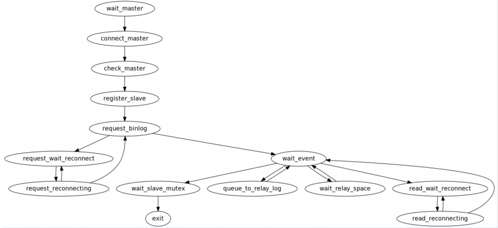 

### SQL_thread 状态

SQL线程状态变更,对应服务器上SQL线程的State字段，通过show processlist查看

名称	|状态值|	解释
----|----|----
wait_relay_event	|Waiting for the next event in relay log|	
read_relay	|	Reading event from the relay log|
wait_io_thread		|Has read all relay log; waiting for the slave I/O thread to update it	|
make_temp_file	|	Making temp file	|
wait_slave_mutex	|	Waiting for slave mutex on exit|

sql thread 状态变更图	如下

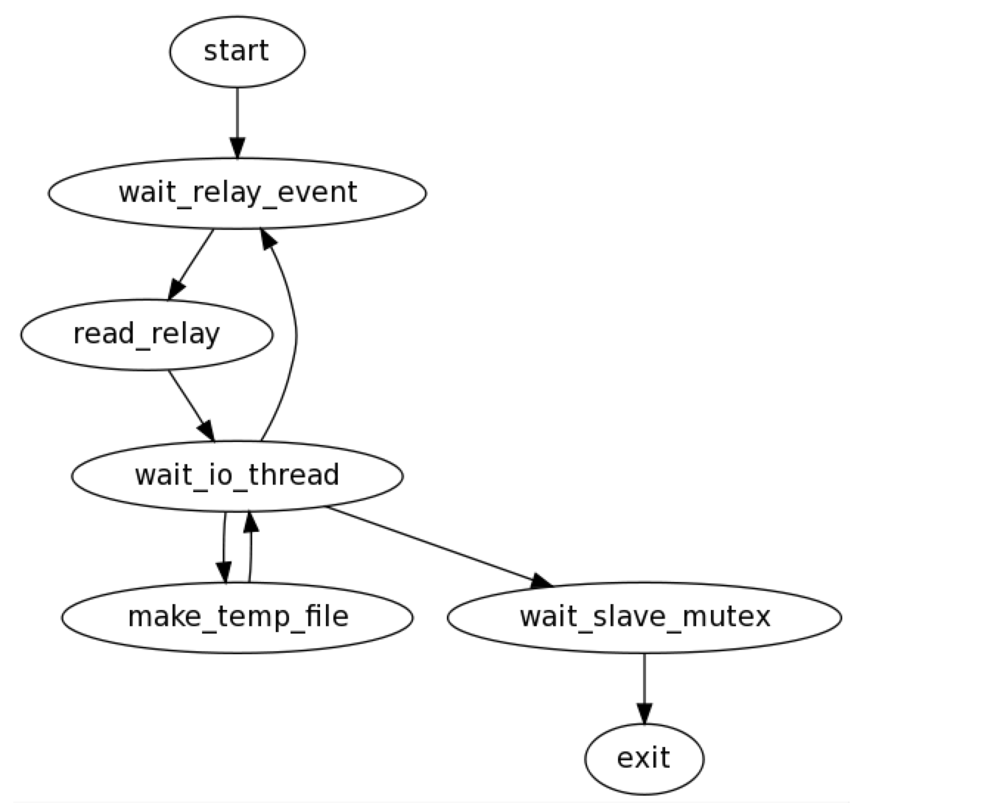 


### IO thread 数据格式（5.1）

* **向master注册自己**

>向主服务器注册自己并不是一个必须的操作，如果没有注册同样可以向主服务器请求数据。如果需要向主服务器注册，那么可以调用mysql.h中的simple_command(mysql,
command, arg, length,
skip_check)函数，在arg参数中依序填入下述的各个字段，并指定其中的参数command为COM_REGISTER_SLAVE以注册自己。

名称| 字节数| 含义
----|----|----
server_id|4 |本MySQL instance的server_id值
strlen(report_host)|1 or 2|标识接下来的report_host的长度，如果长度<251占1个字节，否则占两个字节
report_host|Strlen(report_host)|向主服务器注册的MySQL instance标识
strlen(report_user)|1 or 2|标识接下来的report_user的长度，如果长度<251占1个字节，否则占2个字节
report_user|Strlen(report_user)|向主服务器注册的用户名
strlen(report_password)|1 or 2|标识接下来的report_password的长度，如果长度<251占1个字节，否则占2个字节
report_password|Strlen(report_password)|向主服务器注册的密码
report_port | 2 | 向主服务器注册的端口
rpl_recovery_rank | 4 | 复制的恢复等级
master_id | 4 | 填入0，主服务器将自行填入master_id值

* **向master请求数据**

>从服务器向主服务器发送了请求数据的命令以后主服务器将根据要求将对应binlog文件的指定位置开始的事件记录发送给从服务器。向主服务器请求数据，可以调用mysql.h中的simple_command(mysql,
command, arg, length,
skip_check)函数，在arg参数中依序填入下述的各个字段，并指定其中的参数command为COM_BINLOG_DUMP。


名称| 字节数| 含义
----|----|----
master_log_pos|4|请求主服务器发送的事件记录在binlog文件中的偏移量
binlog_flags|2|暂时填0，做扩展用
server_id|4|本MySQL instance的server_id值
logname | Strlen(logname) | 请求主服务器发送的binlog文件的文件名

向主服务器请求了数据以后，从服务器就可以通过cli_safe_read(mysql);获得主服务器发送过来的数据，每次获得一个事件记录的数据。cli_safe_read的返回值标示了从主服务器发送过来的数据的数据字节数。而发送过来的数据保存在mysql->net->read_pos数组中。I/O
thread模块可以利用MySQL的io_cache将对应事件记录存储到relay-log文件中。

### SQL thread 数据格式（5.1）

> 由于SQL thread 需要执行从master上发送过来的event，这里牵涉到很多event 格式，在binlog章节一起讲述，这里先略过。


## replication internal
---

### 什么是binlog？
> binlog 就是为了复制而存在，将所有数据库更新操作全部记录下来，然后slave可以根据binlog 重演日志，从而保证和master 一致。


### binlog 格式和类型

* **基本结构如下**
 
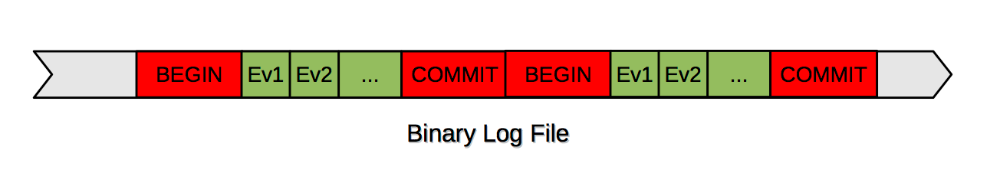


* **binlog format**
	* STATEMENT： 以SQL语句的形式记录
	* ROW ： 以数据文件的格式记录
	* MIXED： 前两者的结合，默认以statment格式记录，当遇到non-deterministic statements的语句时，自动转换成row模式。
	* 可以动态调整： SET BINLOG_FORMAT= [ROW|STATEMENT|MIXED]
	

* **statement format**

```
==特点==
* 可以方便的显示SQL语句
* 可以很方便的在slave上re-executed
* 在语句被executed后，commited前，记录binary log
* DDL 语句总是被记录成statement，即便你设置的是row模式。
* 事件类型是：0x02 → Query_log_event
* Unsafe/non-deterministic statements如下：
	* User-defined functions (UDF)
	* UUID(), FOUND_ROWS(), RAND(), USER()
	* Updates using LIMIT
	* ...
警告信息：
master> INSERT INTO t1 VALUES (RAND());
Unsafe statement written to the binary log using statement format since BINLOG_FORMAT = STATEMENT. Statement is unsafe because it uses a system function that may return a different value on the slave
``` 

* **row format**

```
==特点==
* 5.1 之后被引入
* 在binlog 中记录的是真实的image
* 对于非确定性函数：UUID等，都是安全的。
* 可以用于Mysql cluster环境中。
* 事件类型为： Table_map, Write_rows, Update_rows, Delete_rows
* 只有DML语句才能记录成row
* row模式一般记录的都比较大，尤其是一条语句更新全表的情况。
* row模式，如果没有主键，被发送到slave后，会导致slave hung住。
```

### binlog internal

* **binlog 文件组成**

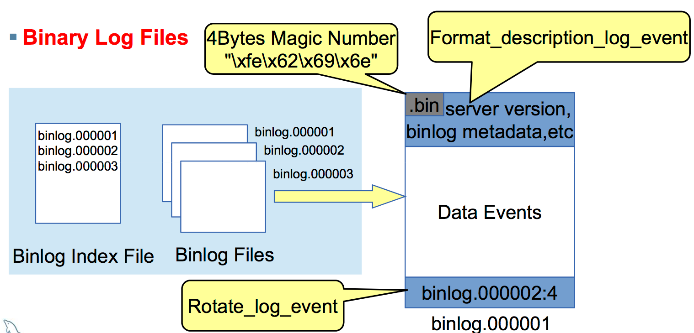

* **Query_log_event**
	* A SQL statement is logged
	* Support DDL, DML and other SQL statements
	
* **row event**
	* Support DML only
	* Table_map_log_event
		* Table metadata
	* Write_rows_log_event：对应insert，只记录After image
	* Update_rows_log_event：对应update，前后都记录
	* Delete_rows_log_event：对应delete，只记录Before image


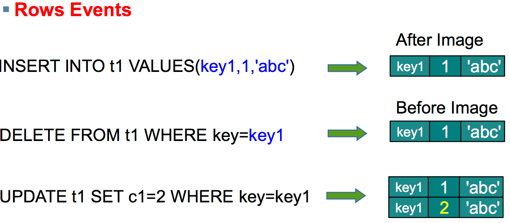

* **transaction event**
	* BEGIN is logged as Query_log_event
	* COMMIT is logged as Xid_log_event
	* Support DML only
	
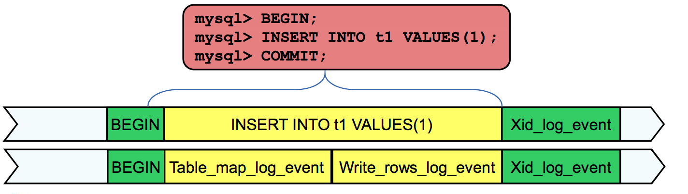


* **binlog初始化文件**

名称|字节数|含义
----|----|----|
BINLOG_MAGIC(即"\xfe\x62\x69\x6e")|BIN_LOG_HEADER_SIZE(4)|Binlog文件的标识值

* **事件头字段描述：各个事件都包括一个事件头**

名称|字节数|含义
----|----|----|
when|4|事件的创建时间。
type|1|事件的类型
server_id|4|事件发生时所在MySQL的server_id值。
data_written|4|该事件一共占用的字节数，包括事件头的字节数
log_pos|4|下一事件在binlog文件中将要开始的位置，即本事件的结束位置
Flags|2|事件的其他标志位

* **ROTATE_EVENT事件字段描述**

名称|字节数|含义
----|----|----|
pos|8|主服务器将要发送的事件记录在binlog文件中的偏移量。一般为从服务器提交的COM_BINLOG_DUMP请求中的偏移量值
new_log_ident|strlen(new_log_ident)|主服务器将要发送的事件记录的binlog文件名。一般为从服务器提交的COM_BINLOG_DUMP请求中的binlog文件名

* **FORMAT_DESCRIPTION_EVENT事件字段描述**

名称|字节数|含义
----|----|----|
binlog_version|2|Binlog文件的版本号，这里一般为最新的版本号4
server_version|ST_SERVER_VER_LEN（50）|MySQL的版本号
Created|4|事件创建时间，这里一般和事件头中的when一致
event_header_len|1|一般事件的事件头长度，一般设置为：LOG_EVENT_HEADER_LEN(19)
post_header_len|ENUM_END_EVENT-1(26)|不同事件类型的附加事件头的长度

* **TABLE_MAP_EVENT事件字段描述**

名称|字节数|含义
----|----|----|
m_table_id|6(5.1.4前的版本中为4)|表的id标识符
m_flags|2|表的各种标志位
m_dblen|1|数据库名的长度
m_dbnam|m_dblen+1|数据库名，以’\0’结尾
m_tbllen|1|表名的长度
m_tblnam|m_tbllen+1|表名，以’\0’结尾
m_colcnt|net_field_length()|表的字段个数，所占字节数根据第一个字节的大小由net_field_length函数确定
m_coltype|m_colcnt|表的各个字段的字段类型

* **WRITE_ROWS_EVENT事件字段描述**

名称|字节数|含义
----|----|----|
m_table_id|6(5.1.4前的版本中为4)|表的id标识符
m_flags|2|表的各种标志位
m_width|net_field_length（）|表的各列的位图长度，所占字节数根据第一个字节的大小由net_field_length函数确定
m_cols.bitmap|(m_width+7)/8|表的各列的位图，每一位表示m_rows_buf是否包含表中一列的值，如果没有置位表示该列的值没有包含在m_rows_buf中
m_rows_buf|剩余字节数(len-已占字节数)|将要插入到表中的一行数据值


* **UPDATE_ROWS_EVENT事件字段描述**

名称|字节数|含义
----|----|----|
m_table_id|6(5.1.4前的版本中为4)|表的id标识符
m_flags|2|表的各种标志位
m_width|net_field_length（）|表的各列的位图长度，所占字节数根据第一个字节的大小由net_field_length函数确定
m_cols.bitmap|(m_width+7)/8|表的各列的位图，每一位表示m_rows_buf是否包含表中一列的值，如果没有置位表示该列的值没有包含在m_rows_buf中
m_cols_ai.bitmap|(m_width+7)/8|表中将要更新的行数据的各列的位图，每一位表示m_rows_buf是否包含表中一列的值
m_rows_buf|剩余字节数(len-已占字节数)|将要插入到表中的一行数据值


* **DELETE_ROWS_EVENT事件字段描述**

名称|字节数|含义
----|----|----|
m_table_id|6(5.1.4前的版本中为4)|表的id标识符
m_flags|2|表的各种标志位
m_width|net_field_length（）|表的各列的位图长度，所占字节数根据第一个字节的大小由net_field_length函数确定
m_cols.bitmap|(m_width+7)/8|表的各列的位图，每一位表示m_rows_buf是否包含表中一列的值，如果没有置位表示该列的值没有包含在m_rows_buf中
m_rows_buf|剩余字节数(len-已占字节数)|将要插入到表中的一行数据值


* **XID_EVENT事件字段描述**

XID_EVENT一般出现在一个事务操作(transaction)之后或者其他语句提交之后。它的主要作用是提交事务操作和把事件刷新至binlog文件中

名称|字节数|含义
----|----|----|
xid|sizeof(xid)|commit标识符

### binlog 处理流程

> mysql会将一个事务内的操作都先写到session binlog cache，然后根据sync_binlog的设置flush binlog到file。
 
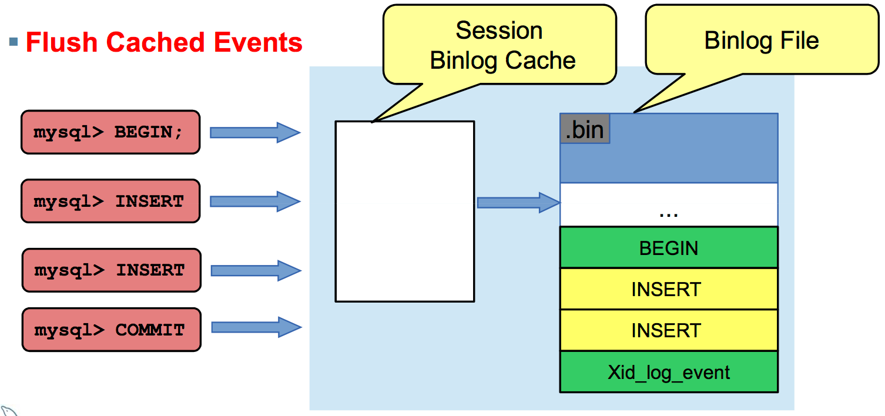


### group commit

InnoDB在每次提交事务时，为了保证数据已经持久化到磁盘（Durable），需要调用一次fsync（或者是fdatasync、或者使用O_DIRECT选项等）来告知文件系统将可能在缓存中的数据刷新到磁盘。这里先讲一下文件写入机制，一般包括三个阶段：open，write，flush。基本知识： flush阶段：fdatasync（），只会刷新数据文件，不包括文件的metadata（如文件大小，时间戳等），fsync（）则会全部刷新，所以fsync做的事情要比其他的sync方式要多，故也非常昂贵。   innodb_flush_method用于控制innodb的刷新方式，废话少说，看下表和图就能一目了然。

 innodb_flush_method| open log | flush log | open datafile | flush datafile
 ----|----|----|----|----
 fdatasync| | fsync() | | fsync()
 O_DSYNC | O_SYNC | | | fsync()
 O_DIRECT||fsync()| O_DIRECT| fsync()
 O_DIRECT_NO_FSYNC||fsync()|O_DIRECT|
 All_O_DIRECT|O_DIRECT | fsync()|O_DIRECT|fsync()|

这里有几个重点：

* innodb_flush_method 控制的不仅仅是redo log，还包括 数据文件。
* 即便innodb_flush_method 设置的是任何值如：fdatasync，最终flush阶段，mysql为了考虑安全性，底层调用的是fsync(),而不是fdatasync();
* 除了O_DIRECT_NO_FSYNC以外，InnoDB都使用fsync()刷新“数据文件”
* 在open阶段，以O_SYNC方式打开文件，自身必须要求文件最终fsync()写入成功，所以不需要在flush阶段调用fsync()

更直观的图如下：

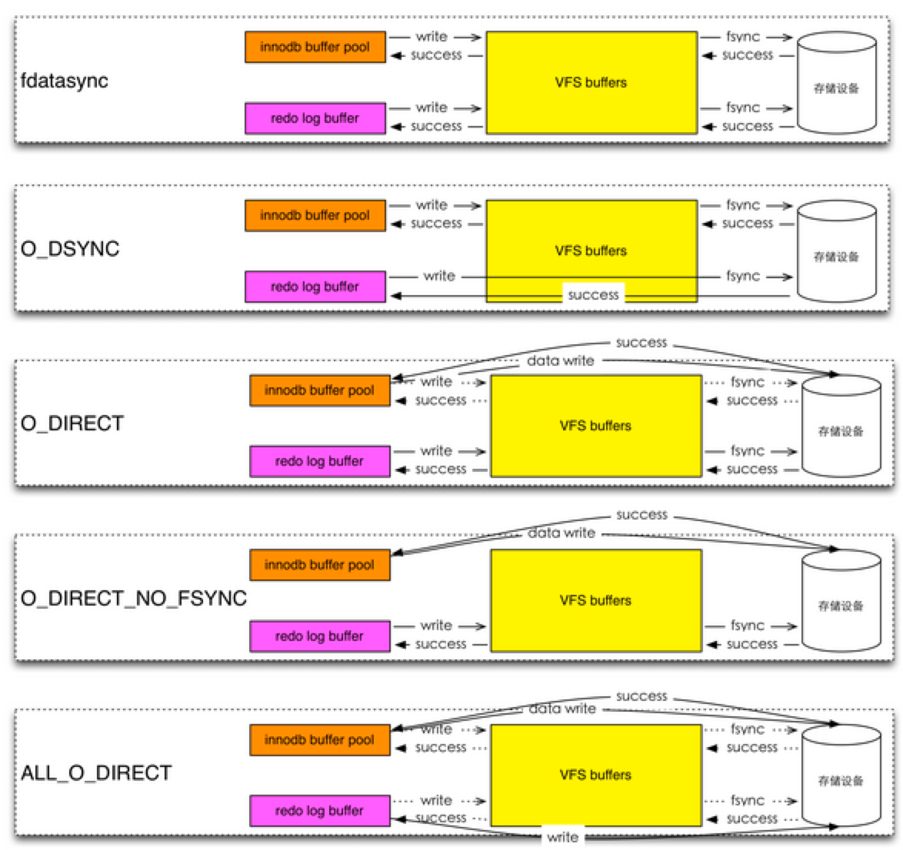

问题：为什么O_Direct,ALL_O_Direct 方式绕过vfs后直接写文件，最终还要调用fsync呢？

没错，他们写文件的时候，只会将文件的数据写入，最后一次fsync就是刷新文件的metadata。

好了，介绍了那么多，现在回到正题。既然，fsync 那么消耗资源，如果可以将多次fsync合并成一次，
这样可以大大提升Mysql的写入效率。就这样的想法，5.0之后由于支持分布式事务和两阶段提交协议，当sync_binlog 设置成1后，为了保证Binlog中的事务顺序和redo log事务顺序一致，被动放弃了Group Commit。
 
 ```
  binlog_prepare (do nothing)

   innodb_xa_prepare  (加锁, 刷新redo log)

    	write() and fsync() binary log  

    binlog_commit

  innobase_commit
 
 ```
 由于在innodb prepare 阶段加了锁，当sync_binlog=1时，也就意味着 write() and fsync() binary log是串行的，且每次只刷新一个事务。如果将nnodb_xa_prepare的锁去掉，又会导致binary log和redo log的顺序不一致，导致slave错乱。由于innodb 本身的prepare/commit 现在已经可以group commit，这里只要能够解决binlog 的commit顺序和innodb commit一致就可以完成。
 
 于是，binlog Ordered Commit的概念被提出。
 
 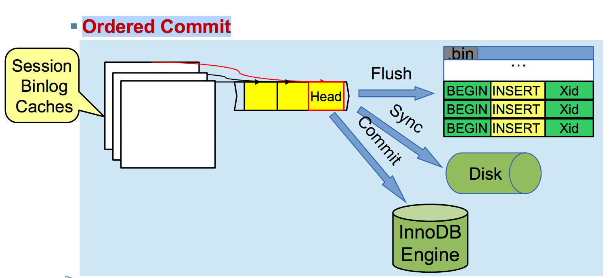
 
 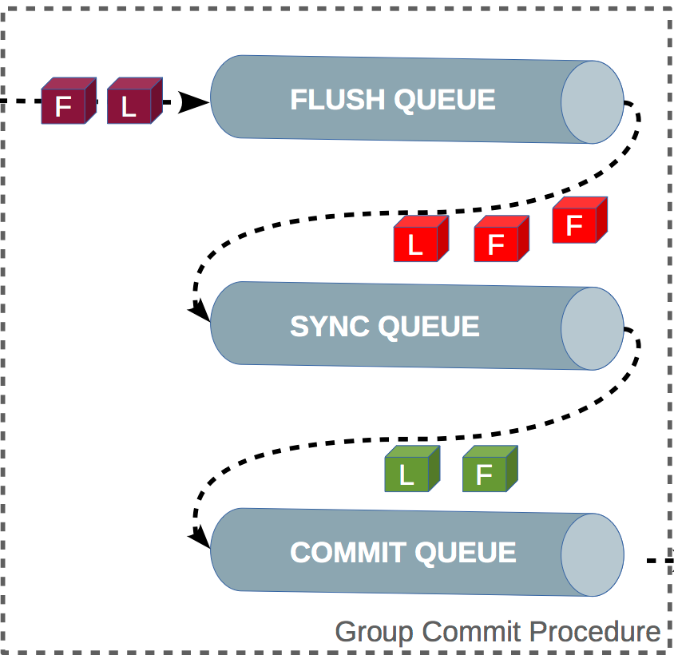
 
 第一个进入队列的作为leader，后面的都是follower，由leader完成所有三阶段操作，这样既能并发，又能保证和innodb log的顺序一致。
 
 
### multi thread slave（5.6）

5.6 的多线程复制是基于schema的。每类相同的库，由一个worker负责跟进。

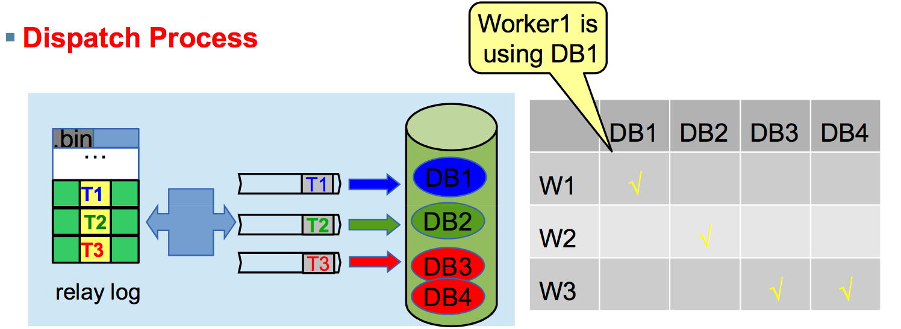

特点：

```
* 如果有一条语句操作多个库，那么这个是不会被调度的，还是走原来的流程。
* 如果应用方只有一个库，根本提升不了效率。
* 会导致slave 上的执行顺序被颠倒，导致传统模式的复制，无法change master。不过可以用GTID弥补。 
```

### multi thread slave（5.7.2）

由于现在的mysql可以保证在同时在prepare阶段的事务order commit，所以利用这一点，只要两个事务在prepare阶段相交，且第一个事务commit完成前，后一个事务还在prepare阶段，就可以被安排并行执行。

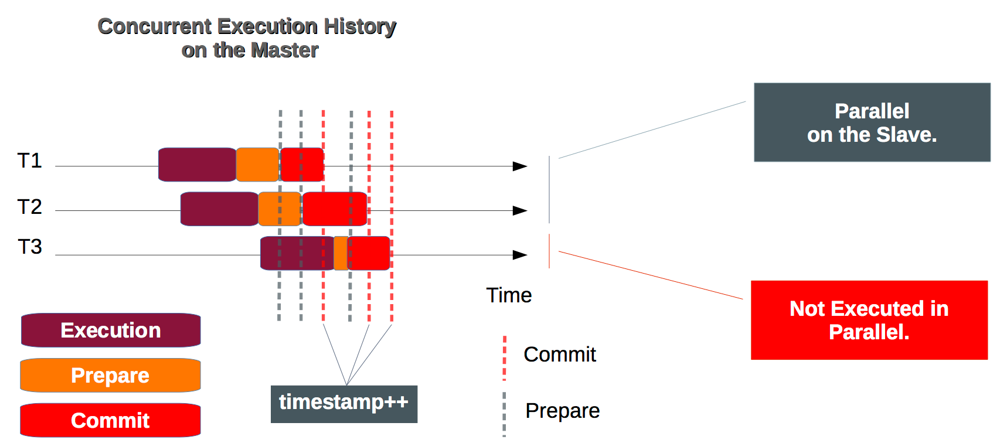


### multi thread slave（MariaDB）

MariaDB的做法被认为是最好的，它是按照relay log的日志写入顺序作为slave的commit顺序。之前都是由

一个sql线程读取和回放relay log日志，现在不同的是多个线程回放。它内部会维护一个数据结构
commit_order，里面有一个递增的计数器，每读relay-log一个事务，计数器会被分配，而且每一个线程读取
到的数据结构中，都会记录当前等待的commit事务和需要唤醒的事务，如果等待的事务没有commit，自己是没有办法提交的。。

```
Struct commit_order
{
  Int own_Commit_id;
  Int Wait_commit_id;
  Bool waiting_for_commit；
  Struct commit_order *waiter；
  LIST waitees;
  LOCK_commit_order;
  COND_commit_order;
}
``` 
 
* 当一个事务执行到提交阶段时，首先判断是否需要等待提交，若需要则进行条件等待
* 当一个事务提交完毕之后，需要唤醒等待它的事务(Wait_commit_id++,Wait_commit_id--)
* 回放日志是并行的，commit是串行的，事实上，即便是在master上，任何并发事务最终也是串行。


### Row-based Replication Enhancements

> 上面已经提到过，row模式的复制的缺点就是binlog文件会比statment格式的大很多，所以
为了提升效率，5.6 做了一些改进.

* SET binlog_row_image = [MINIMAL | NOBLOB | FULL] – default is FULL
* FULL：before & after image 都会记录所有字段内容
* NOBLOB：当NOBLOB没有改变的时候，不会记录BLOB值
* MINIMAL：before image只记录主键，after image 只记录被修改的值

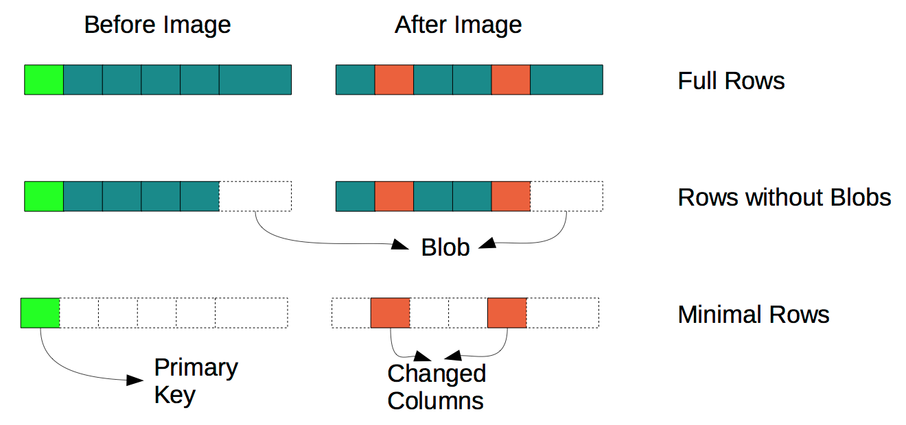


## new replication GTID
---

### GTID能解决什么问题

* 传统模式的困扰1

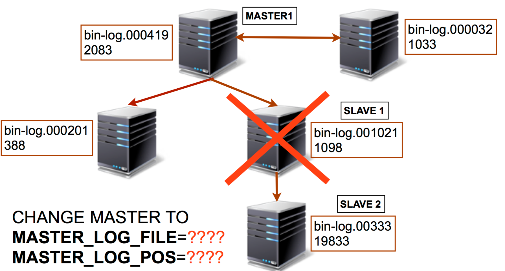

* 传统模式的困扰2

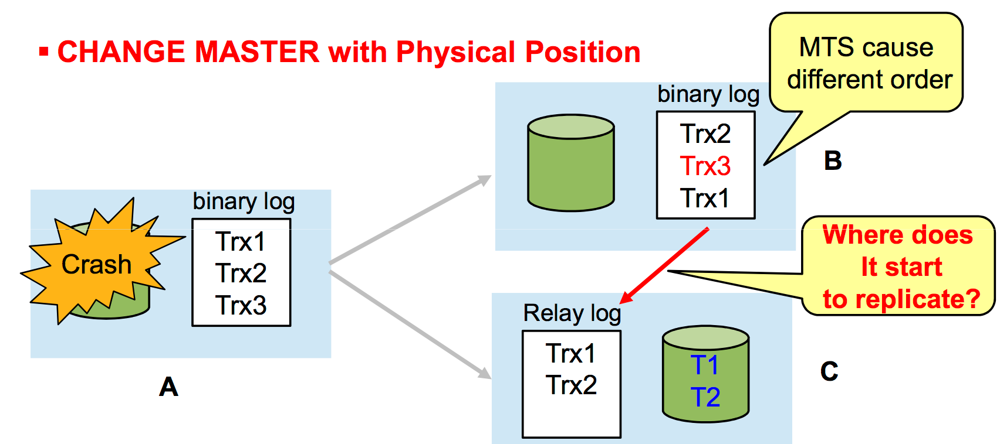

* GTID make DBA'life easy

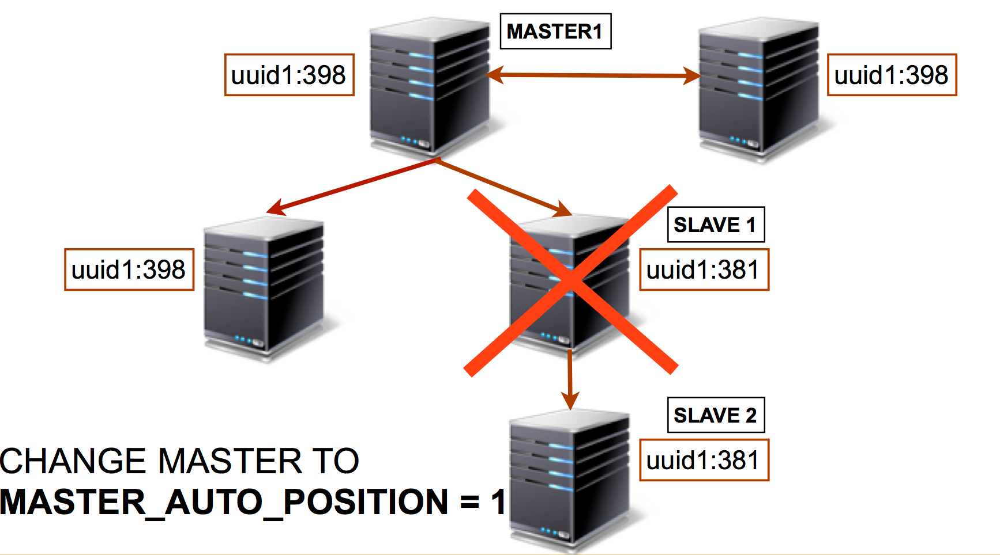


### 什么是GTID

* global transaction identifiers
* 样例：965d996a-fea7-11e2-ba15-001e4fb6d589：1，即：$uuid:$tin

````
==UUID==
	* server_uuid 在auto.cnf中，如果此文件被删除，会自动重建且重新generate一个uuid
	* 128-bit identification number （uuid）
	* GTID 会写在binlog中
==TIN==
	* TIN – 64-bit transaction identification number
 	* 每一个事务会产生一个sequence，且递增
 	* 从1开始，而不是0
````

### 如何配置GTID

开启下面四个参数

* gtid_mode

* log_bin(existed)

* log-slave-updates

* enforce-gtid-consistency

### 新的复制协议 COM_BINLOG_DUMP_GTID

* Slave sends to master range of identifiers of executed transactions to master
* Master send all other transactions to slave
* 同样的GTID不能被执行两次，如果有同样的GTID，会自动被skip掉。

### binlog 的格式

* GTID 写入binlog的格式图

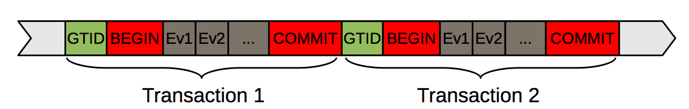

* 详细格式图

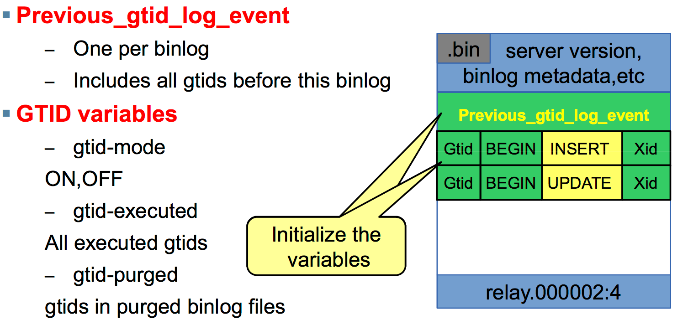

### GTID usage

mysql> CHANGE MASTER TO MASTER_AUTO_POSITION=1, MASTER_HOST='...';

### Automatic Positioning

* Slave sends @@gtid_executed to master

* Master sends all other transactions to slave

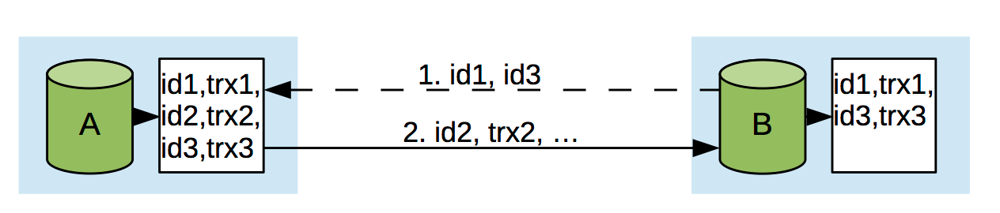

* fail over

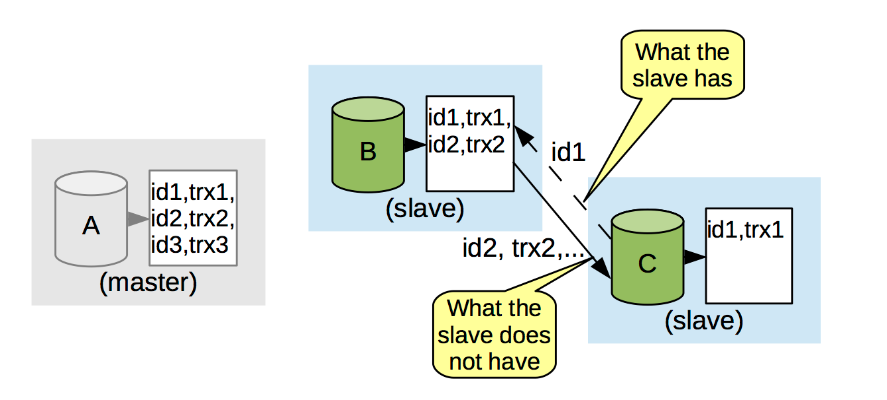

### 如何skip transaction


* 传统模式很好搞定，一条skip 命令即可。

* GTID 模式可以这样么？why？

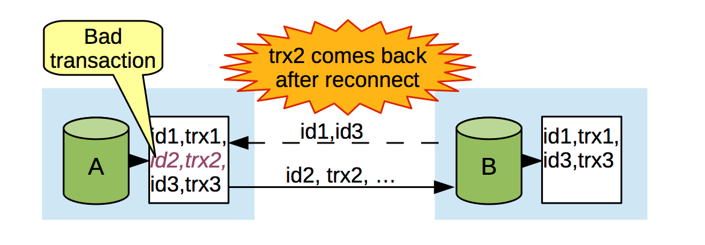

由此可知，我们不能这样做，当然Mysql也不支持这样的skip命令。

* 如果slave报错，我们如何skip掉这个bad 事务呢？官方推荐插入空事务

	* set gtid_next=”id2”; commit； 啥也不做，只是插入一个事务id
	
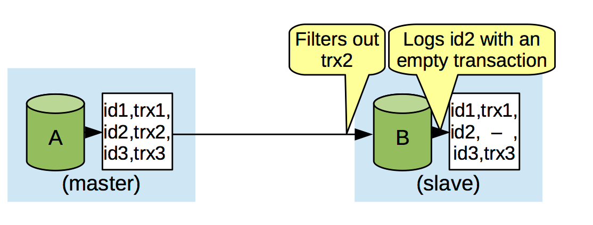

* **思考，这样做真的天衣无缝么？**

```
* 如果这台插入空事务的slave 某一天被提升成为new master，会有什么后果？
    后果就是：其他还没有执行成功这条事务的slave，当change new master的时候，就不会执行这个事务了。（相当于丢失了这个事务）
    
解决办法就是：
1）不要插入空事务，用set sql_log_bin=0模式，修复好slave，让bad transction 修好。
2）如果已经插入了空事务，那么就用pt-table-checksum + pt-sync（set sql_log_bin=0） 修复数据。
```

### Purged and Executed

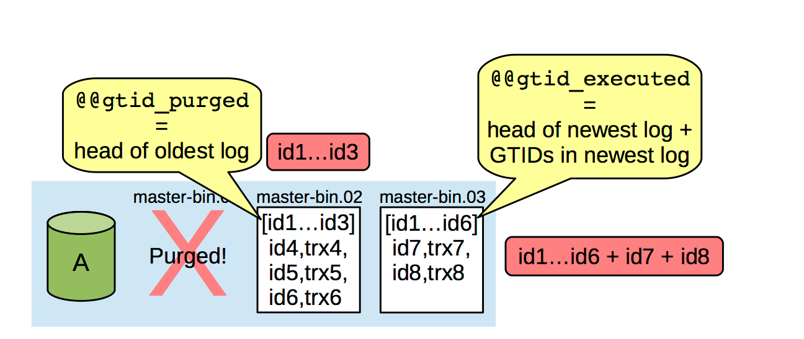


### 如何搭建GTID环境下的slave

* 第一种情况，如果master有所有日志，那么slave啥都需要，直接change master即可。

* 第二种情况，就是从拉出全备，然后change master，这里的关键点就是：SET @@GLOBAL.GTID_PURGED = “@@GTID_EXECUTED at backup”

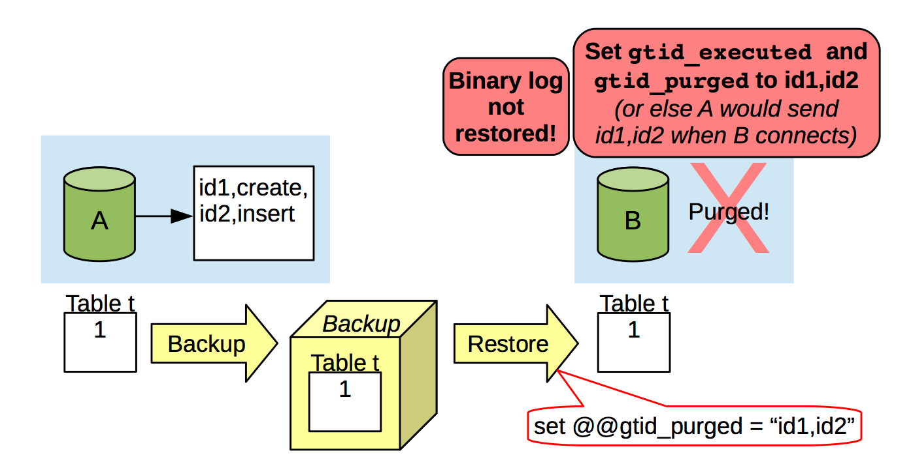

* 试想想看，如果不设置GTID_PURGED，GTID_EXECUTED 会怎么样呢？


### GTID major limitation

```
* 更新非事务引擎
	1) MASTER:对一个innodb表做一个多sql更新的事务,效果是产生一个GTID
	2) SLAVE:对应的表是MyISAM引擎.执行这个GTID的第一个语句后就会报错,因为非事务引擎 一个sql就是一个事务.
	
* 一个SQL同时操作Innodb引擎和MyISAM引擎

* 在一个replication group中,所有的mysql必须统一开启或者统一关闭GTID
功能.


* GTID_MODE是not online的,这个限制比较坑爹，个人认为是最大的缺点。（据说 5.7 已经online了）
```


## 参考资料

* 以上图片，均来自互联网
* 博客和书籍

```
==书籍==
* innodb 存储引擎
* 高性能Mysql
* 官方文档-复制，GTID
* mysql 内核

==博客==
http://www.youtube.com/watch?v=kaoj_3lgYqQ  
http://www.youtube.com/watch?v=zZ02_nhzY0w#t=172
http://www.youtube.com/watch?v=oOHyV54dVt0
http://www.youtube.com/watch?v=PyMMC4cxB0k

http://in355hz.iteye.com/category/264353
http://qing.blog.sina.com.cn1757661907/68c3cad333002qhe.htmlsudaref=209.116.186.246
http://in355hz.iteye.com/blog/1770399vv
http://in355hz.iteye.com/blog/1770401
http://www.mysqlperformanceblog.com/2013/05/21/replication-in-mysql-5-6-gtids-benefits-and-limitations-part-1/
http://www.mysqlperformanceblog.com/2013/05/30/replication-in-mysql-5-6-gtids-benefits-and-limitations-part-2/
http://www.mysqlperformanceblog.com/2013/02/08/how-to-createrestore-a-slave-using-gtid-replication-in-mysql-5-6/
http://www.mysqlperformanceblog.com/2014/05/09/gtids-in-mysql-5-6-new-replication-protocol-new-ways-to-break-replication/  --New replication protocol; new ways to break replication
http://www.mysqlperformanceblog.com/2014/05/19/errant-transactions-major-hurdle-for-gtid-based-failover-in-mysql-5-6/ --errant transactions


http://www.orczhou.com/index.php/2010/08/time-to-group-commit-1/
http://www.orczhou.com/index.php/2011/12/time-to-group-commit-2/
http://www.cnblogs.com/hustcat/p/3577584.html
http://www.isadba.com
http://kristiannielsen.livejournal.com/12254.html
http://kristiannielsen.livejournal.com/12408.html
http://kristiannielsen.livejournal.com/12553.html
http://kristiannielsen.livejournal.com/12810.html

http://www.orczhou.com/index.php/2009/08/innodb_flush_method-file-io/
http://www.woqutech.com/?p=1459

http://hatemysql.com/2011/10/29/mysql%E4%BA%8B%E4%BB%B6%E7%B1%BB%E5%9E%8B%E5%92%8C%E6%96%87%E4%BB%B6%E5%A4%B4%E9%95%BF%E5%BA%A6/
http://hatemysql.com/2011/10/29/mysql-replication%E6%95%B0%E6%8D%AE%E5%A4%8D%E5%88%B6%E6%A0%BC%E5%BC%8F/
http://hatemysql.com/2011/12/14/mysql-show-slave-status/ 
http://hatemysql.com/2013/04/15/mysql%E6%95%B0%E6%8D%AE%E4%B8%A2%E5%A4%B1%E8%AE%A8%E8%AE%BA/ 
http://hatemysql.com/2012/11/23/%E6%B7%98%E5%AE%9D%E7%89%A9%E6%B5%81mysql-slave%E6%95%B0%E6%8D%AE%E4%B8%A2%E5%A4%B1%E8%AF%A6%E7%BB%86%E5%8E%9F%E5%9B%A0/ 
http://in355hz.iteye.com/blog/1770398
http://in355hz.iteye.com/blog/1770399
http://in355hz.iteye.com/blog/1770401

http://www.mysqlplay.com/2013/12/mysql%E5%B9%B6%E8%A1%8C%E5%A4%8D%E5%88%B6%E7%9A%84%E9%A1%BA%E5%BA%8F%E6%8F%90%E4%BA%A4/ 

http://Binary log API_ A Library for Change Data Capture using MySQL Presentation
http://CON5084_Carvalho-CON5084-MySQLReplicationGlobalTransactionIdentifiers
http://Failover_GTID_MySQL_56
http://GTID_based_replication_for_MySQL_High_Availability_0570
http://MySQL_5.6-InnoDB_Features_Scalability
http://mysql_56_GTID_in_a_nutshell
http://MySQL_GTID_in_Production
http://MySQL_replication_internals 
http://MySQL_Replication_Mythology
http://pythian-repl-121204083902-phpapp01
http://Replication_MySQL_56-expanded
http://TUT5019_Carvalho-TUT5019-MySQLReplicationTipsAndTricks

http://mysqllover.com/?p=87
http://www.fromdual.com/gtid_in_action
http://fromdual.com/replication-troubleshooting-classic-vs-gtid 
http://blog.booking.com/mysql-5.6-gtids-evaluation-and-online-migration.html  
http://blog.marceloaltmann.com/en-mysql-5-6-replication-with-gtid-global-transaction-id-pt-replicacao-com-gtid/
http://datacharmer.blogspot.com/2013/02/parallel-replication-and-gtid-tale-of.html
http://scriptingmysql.wordpress.com/2012/12/06/using-the-mysql-script-mysqlfailover-for-automatic-failover-with-mysql-5-6-gtid-replication/
```


