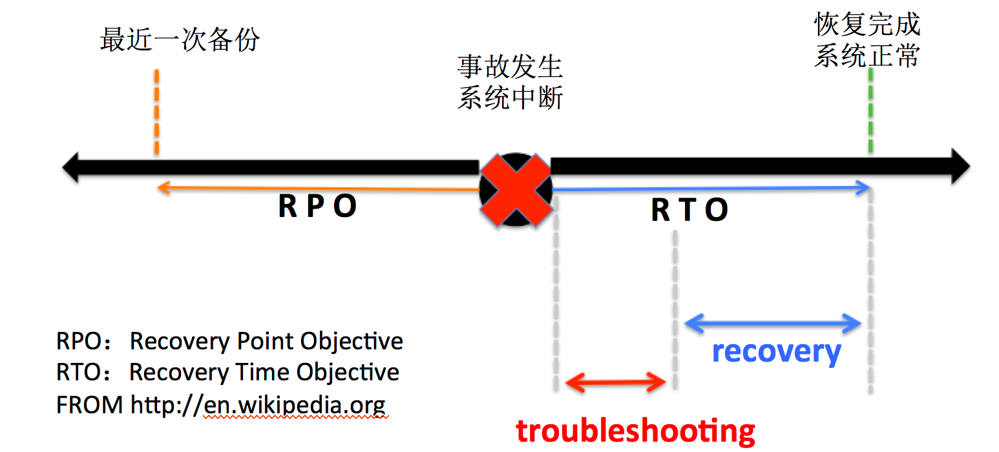
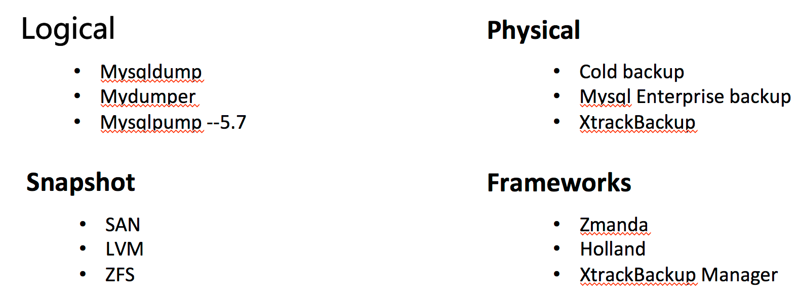
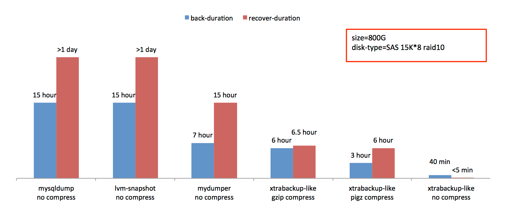
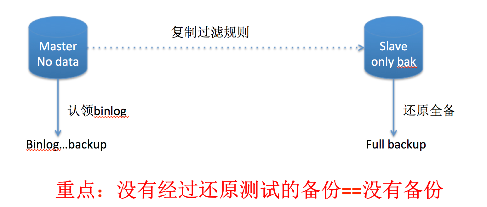

# 备份与恢复

> 大家都知道，备份的目的是用于恢复，恢复必须保证两点：速度，正确性。  
> 接下来，我们聊聊备份恢复的那些事儿   


## 备份和恢复业界指标



## 常用备份方式



## 备份&恢复速度

 

## 恢复架构图

  

## 恢复的原理和实践


* **mysqlbinlog + script**

```
1) 这种方法，我想用过的人都知道，不仅麻烦，还很有可能出错
```


* **利用IO-thread 恢复**

```
0) 必须关闭binlog server的MySQL实例

1) 修改binlog server的部分信息


	a) vi /etc/my.cnf
		log-bin=/data/mysql.bin/binserver
		
	b）vi binserver.index
		 /data/mysql.bin/binserver.000001
		 /data/mysql.bin/binserver.000002
		 ... 以此类推（需要恢复的binlog日志）
		
	c）show master status 检查一下是否修改有效。
	
	d) 注意点：
		binserver.index 里面写的内容 一定要和外面一致。
		
		比如： cat  binserver.index
				/data/mysql.bin/binserver.000001
				/data/mysql.bin/binserver.000002
		那么:  /data/mysql.bin/ 里面一定要有 binserver.000001，binserver.000002 文件
		
2）full backup server 导入全备的数据，记录要同步的文件，postion，以及只同步那些表，都设置好。
	a ) 从全备中拉出需要还原的表，放在对应的DB里面。
	b ) 设置过滤规则，需要在my.cnf文件中设置，需要重启mysql才能生效
		比如：我只恢复某几张表
			replicate-wild-do-table=newhome_db.ugc_dianping
			replicate-wild-do-table=newhome_db.ugc_dianping_content
			replicate-wild-do-table=heartbeat_db.heartbeat
	c）关于复制过滤规则的详细说明，请看http://keithlan.github.io/2015/07/14/mysql_replicate_rule/
	
3）change master 的positon 就是：从全部拉出来的文件的position：relay-log.info

4）start slave until master position 就是： 恢复截止的position
	START SLAVE UNTIL MASTER_LOG_FILE = 'log_name', MASTER_LOG_POS = log_pos

```


* **利用SQL-Thread**

```
原理同上
```


## 总结

> 以上，我用的比较多的就是利用IO-thread来做基于position和time的恢复。  
> 如果大家还有什么好的方法，互相交流学习下，Thanks


